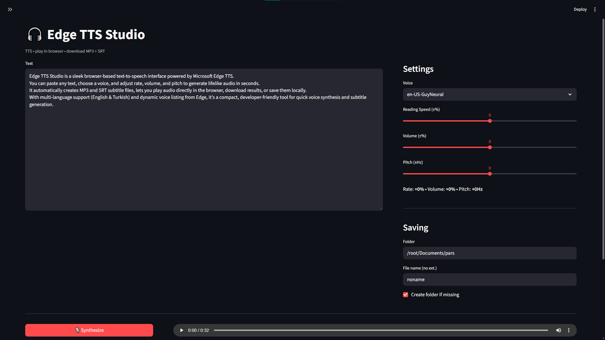

## Voicer

Simple Microsoft Edge TTS Voiceover script

how it's work for dev `uv run streamlit run main.py`
 
## Run with **Docker**

```bash
docker compose up -d --build
```

## APP Preview




### Example Voice Result

[Microsoft Edge TTS voice message .mp3](https://github.com/farukseker/voicer/blob/main/.preview/edge_test_output.mp3)