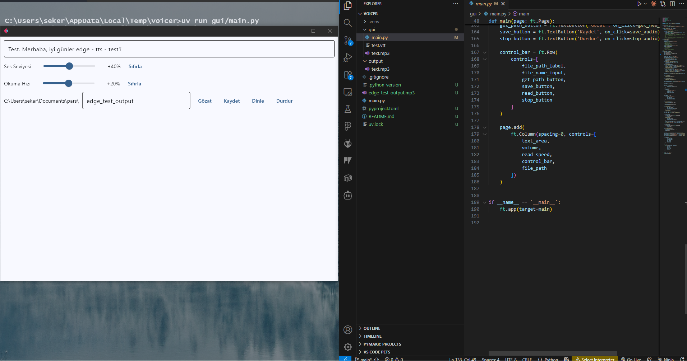

## Voicer

Simple Microsoft Edge TTS Voiceover script

how it's work `uv run gui\main.py`

## APP Preview

### Example Voice Result

[Microsoft Edge TTS voice message .mp3](https://github.com/farukseker/voicer/blob/main/edge_test_output.mp3)